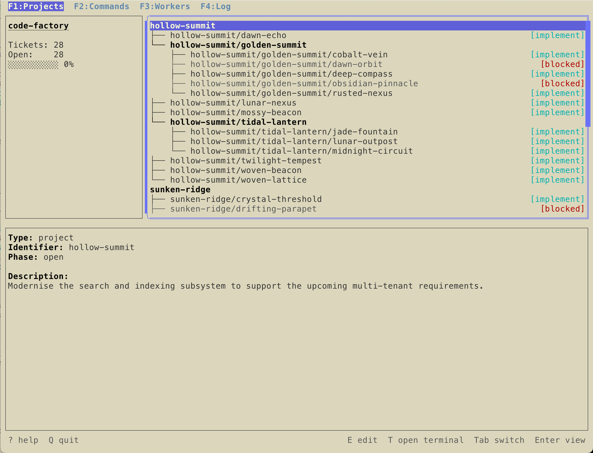
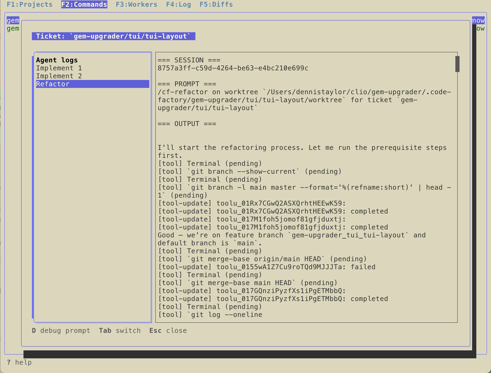
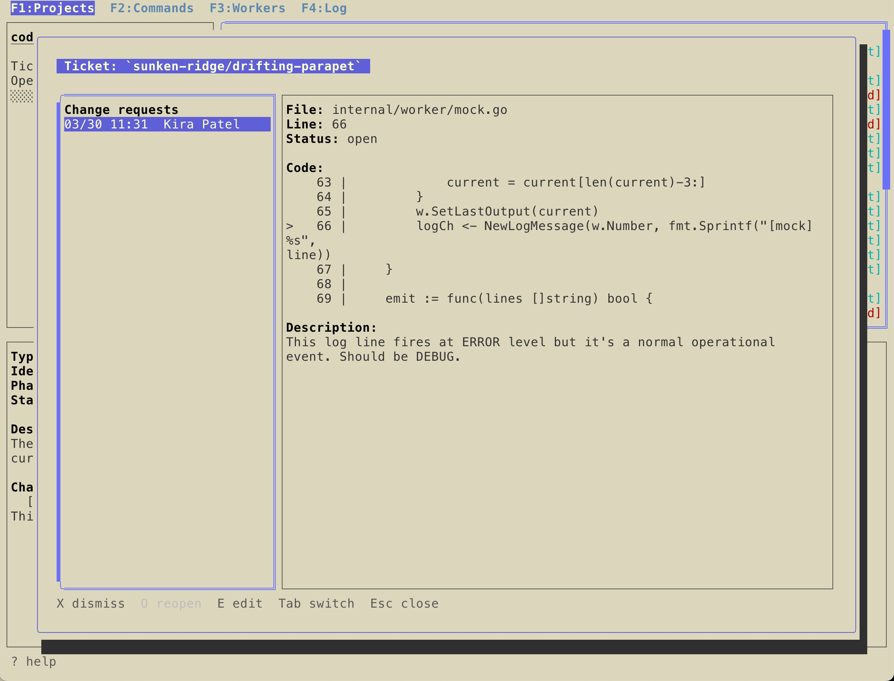
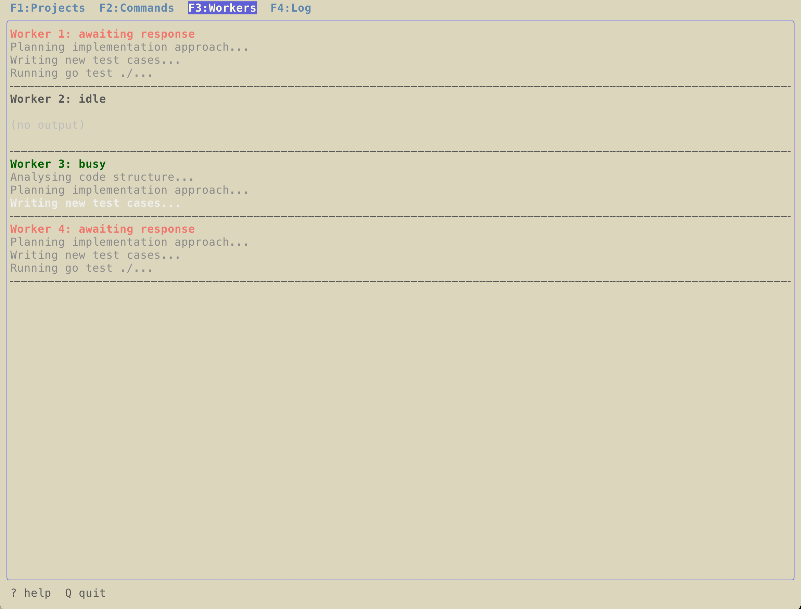
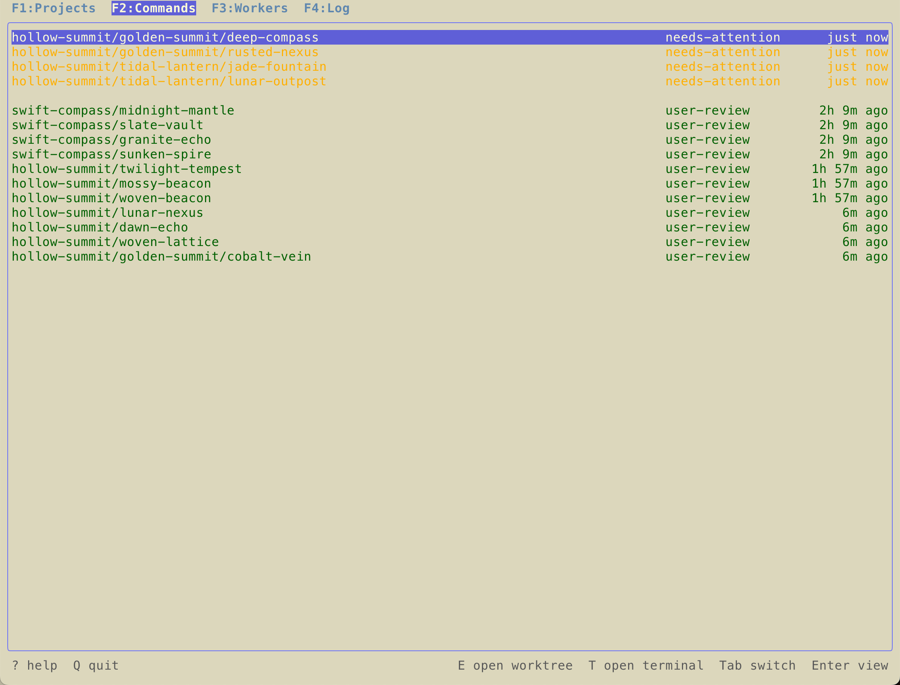
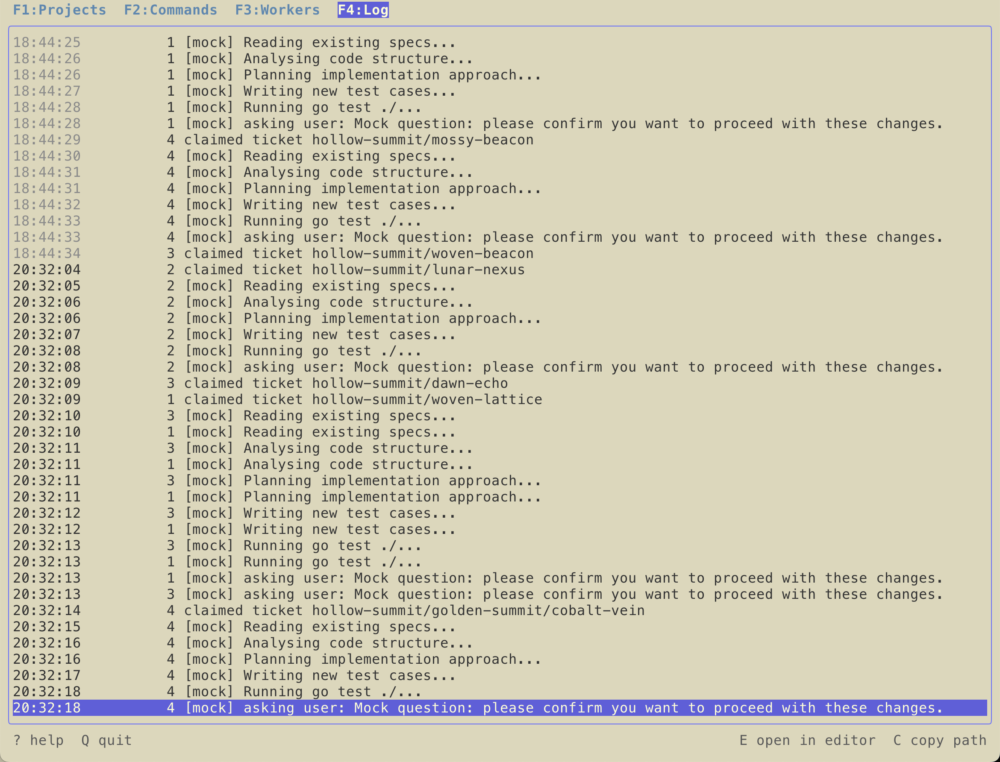

# code-factory

An AI coding agent manager that automates as much of the software-building process as possible. `code-factory` runs a pool of [Claude Code](https://claude.ai/code) agents that automatically work through your project's tickets — writing code, refactoring, reviewing, and responding to change requests — while you supervise from a terminal UI.

Tickets live in a `.code-factory/` directory inside your repository alongside your code. Each ticket gets its own git branch and worktree, so agent work is always isolated and reviewable before merging.

---

## Ticket phases

Each ticket moves through four phases of work:

| Phase | What the agent does |
|-------|-------------------|
| `implement` | Writes specs first, then implements the ticket |
| `refactor` | Refactors and cleans up the resulting code |
| `review` | Reviews the refactored changes and makes change requests |
| `respond` | Applies any open change requests which it deems worth doing |

You approve each phase transition. When all phases are done, the ticket's branch is merged into its parent project's worktree (or the repo's `main` or `master` branch) and the worktree is removed.

---

## Getting started

### Prerequisites

- Go 1.21+
- [Claude Code](https://claude.ai/code) installed and authenticated
- A git repository to work in

### Install

```sh
$ git clone https://github.com/fimmtiu/code-factory
$ cd code-factory
$ make install
```

This builds and installs three binaries to `~/bin/` and installs the Claude Code skills to `~/.claude/skills/`. To install the binaries to a different directory, specify `INSTALL_DIR` on the command line:
```sh
$ INSTALL_DIR=/usr/local/bin make install
```

### Set up a repository

```sh
$ cd your-project
$ cf-tickets init
```

This creates `.code-factory/` with a default `settings.json`. Edit `settings.json` to configure your editor:

```json
{
  "editor": "cursor"
}
```

Supported editors: `cursor`, `vscode`. (For more settings, see [the `code-factory` README](cmd/code-factory/README.md).)

## Using code-factory

It's best to use Opus as the model when you're planning the work, so run `/model opus` in Claude's terminal UI before you start running any skills.

**Step 1: Write a specification.** Create a markdown document that describes in detail what you want your new program or feature to do.

**Step 2: Revise the specification.** Open a Claude agent and run the `/cf-clarify` skill on your specification to have it identify parts of your specification that are unclear or contradictory.
```
/cf-clarify @doc/design.md
```

You can address its comments manually, or just ask it to update the specification with its suggestions. When you're ready, proceed to...

**Step 3: Make tickets.** In your Claude agent, run the `/cf-project` skill on the specification to decompose it into projects, subprojects, and tickets.
```
/cf-project @doc/design.md
```

**Step 4: Start code-factory.**
```sh
$ code-factory
```
Workers will immediately start claiming and working on idle tickets.

**Step 5: Keep a watchful eye on it.** When a worker needs to ask you for permission to run a command, you'll get a macOS notification. On the Commands view, that ticket will be at the top of the list in the `needs-attention` state. Hit Enter on the ticket to see what command it's trying to run, then choose whether to approve or deny it.

Whenever a worker completes a particular phase on a ticket, it will show up in the Commands view in the `user-review` state. Inspect the work:

* Hit Enter to see all the agent logs and change requests for the ticket
* Hit `g` to inspect the commits on that ticket's worktree
* Hit `t` to open a terminal in the ticket's worktree
* Hit `e` to open an editor window in the ticket's worktree

If you're satisfied with the changes, press `a` to approve the changes and push the ticket to the next phase.

---

## Terminal UI

The TUI has five views (switch with F1–F5 or Shift+Tab):

- **F1: Projects** — Hierarchical tree of all work units, with a status pane and detail view. Press Enter on a ticket to see its change requests and logfiles.
- **F2: Commands** — Actionable tickets waiting for your input (`needs-attention`) or review (`user-review`). Press A to approve, R to respond to an agent question, D to open a debug prompt.
- **F3: Workers** — Live view of each agent worker: status, current output, and activity.
- **F4: Log** — Timestamped history of all worker actions with access to raw agent logfiles.
- **F4: Diffs** — Allows you to interactively look through a ticket's commit history and

Here are some screenshots, though the terminal UI is in flux and these will be out of date quickly. (Note that the tickets and comments are all randomly generated placeholders from the `cf-testdata` program and are not expected to make sense.)

| Projects view | Agent logs | Change requests |
|    :---:      |     :---:  |    :---:        |
|  |   |  |

| Commands view | Workers view | Log view |
|    :---:      |     :---:  |    :---:        |
|  |   |  |

---

## Binaries

| Binary | Purpose |
|--------|---------|
| `code-factory` | Terminal UI agent manager — the main program |
| `cf-tickets` | CLI for managing projects, tickets, and change requests |
| `cf-testdata` | Generates test data for UI development and testing |

See each binary's README in `cmd/` for full documentation.

---

## Claude Code skills

The `skills/` directory contains Claude Code skills that are installed to `~/.claude/skills/` by `make install`. These are used by agent workers during the refactor, review, and respond phases:

| Skill | Trigger | Purpose |
|-------|---------|---------|
| `cf-clarify` | `/cf-clarify` | Identify underspecified parts of a design document |
| `cf-project` | `/cf-project` | Decompose a large project into tickets |
| `cf-refactor` | `/cf-refactor` | Scan and refactor recent changes for code smells |
| `cf-review` | `/cf-review` | Thorough multi-perspective code review |
| `cf-respond` | `/cf-respond` | Apply change requests to a ticket's worktree |

---

## Development

```sh
$ make build    # Build all three binaries
$ make test     # Run the test suite
$ make lint     # Run go vet and gofmt
$ make clean    # Remove built binaries
$ make install  # Build, install to ~/bin/, and install skills
```

For UI testing without running real agents:

```sh
$ cf-testdata --reset       # Delete all existing tickets and generate test data
$ code-factory --mock       # Run with fake workers
```

---

## Repository layout

```
cmd/
  code-factory/   Terminal UI agent manager
  cf-tickets/     CLI management tool
  cf-testdata/    Test data generator
internal/
  config/         Settings loading and validation
  db/             SQLite database layer
  gitutil/        Git worktree operations
  models/         Domain types (WorkUnit, ChangeRequest, etc.)
  storage/        Path utilities and .code-factory/ initialisation
  ui/             Bubbletea terminal UI
  util/           Shared utilities (editor, clipboard, terminal)
  worker/         Agent worker pool and ACP integration
  workflow/       Ticket approval and phase-transition logic
skills/           Claude Code skills for working with code-factory projects
```

# TO DO

* Terminal themes, especially new themes for dark mode and all-white terminals. (This was developed on terminals with a light tan background.)

* Support for more editors. (Currently we only support VS Code and Cursor.)

* Auto-detect whether the user is using iTerm or macOS Terminal, then set the "open terminal window" command automatically.
